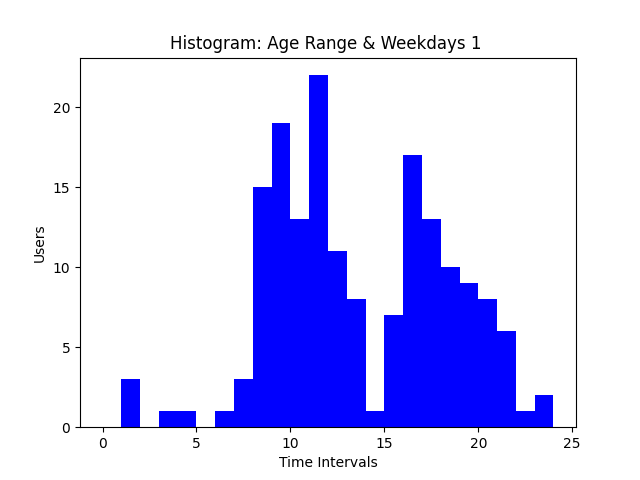
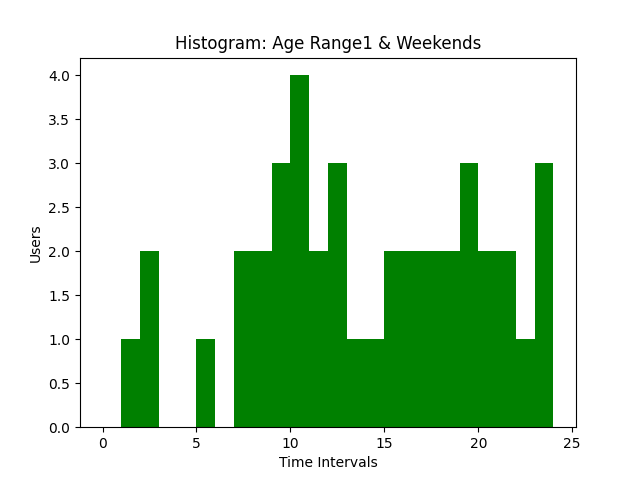

# bicimad-grupo22
PRPA: Práctica 4, Spark

Teníamos una idea inicial que no pudimos resolver ya que no pudimos ejecutar nuestro programa 'practica4_spark_plot_all.py' en el cluster. El problema que nos salía era el que se encuentra en 'Screenshot from 2023-05-28 20-46-50.png'. Creemos que este se debe a usar la librería matplotlib.

Para probarlo en nuestro ordenador con las sample hicimos 'practica4_simple.py'. Las gráficas mostradas abajo se obtuvieron con este código. Estas sí cumplen con lo que queríamos.

Para obtener resultados del cluster se hizo el programa 'funciona.py', el cual devuelve todos los valores necesarios para pintar el histograma. Estos se encuentrar en el archivo 'resultados'.

## Definición del problema a resolver
Hemos utilizado los datos de Bicimad para encontrar cuántos viajes se realizan por intervalos de tiempo entresemana y los fines de semana por cada rango de edad. Pensamos que sería interesante conocer esta información para intentar ver reflejados algunos posibles usos de las bicicletas: si las personas jóvenes lo usan los fines de semana de madrugada es posiblemente para ir o volver de fiesta (esto puede verse en el ejemplo puesto abajo, los findes las personas de 0-16 años usan más las bicicletas por la noche en comparación con los días de diario), si los adultos las usan entresemana a primera hora de la mañana para ir al trabajo, etc.

## Diseño e implementación en Spark
Dado el tamaño de los datos hemos utilizado Spark en python, pyspark. 

unplug_hourTime: Franja horaria en la que se realiza el desenganche de la bicicleta. 

ageRange: Número que indica el rango de edad del usuario que ha realizado el movimiento. Sus posibles valores son:
- 0: No se ha podido determinar el rango de edad del usuario
- 1: El usuario tiene entre 0 y 16 años
- 2: El usuario tiene entre 17 y 18 años
- 3: El usuario tiene entre 19 y 26 años
- 4: El usuario tiene entre 27 y 40 años
- 5: El usuario tiene entre 41 y 65 años
- 6: El usuario tiene 66 años o más 

Hemos eliminado los datos con ageRange = 0.
## Ejemplo




## Inclusiones
```python
from pyspark import SparkContext
import matplotlib.pyplot as plt
import json
from datetime import datetime
```

